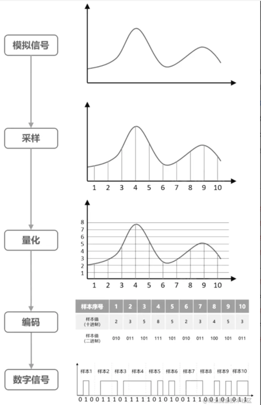
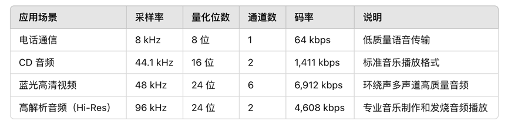
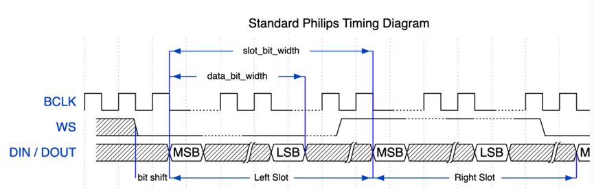
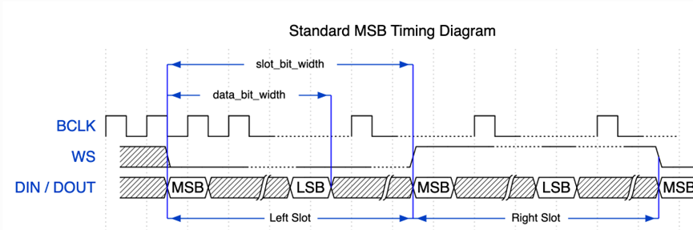
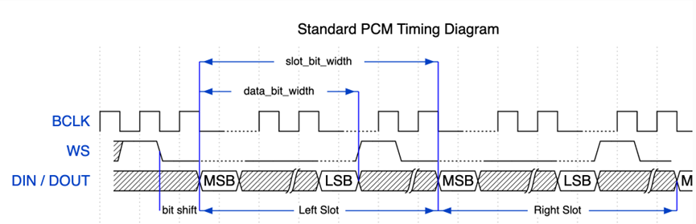

# 相关知识介绍

# 音频相关知识
## 声音的物理特性
声音是由物体振动产生的，通过空气、固体、液体等介质进行传输的一种声波，可以被人耳识别的声波的范围是 20Hz~20000Hz 之间，也叫做**可听声波**，这种声波称之为声音，根据声波频率的不同可以主要分为：

（1）可听声波：20Hz~20kHz

（2）超声波：> 20kHz

（3）次声波：< 20Hz

此外，人的发声范围一般是 85Hz~1100Hz。

## 声音的三要素
1. **音调：**

指的是声音频率的高低，表示人的听觉分辨一个声音的调子高低的程度，物体振动的快，发出的声音的音调就高，振动的慢，发出的音调就低。

2. **音量：**

又称音强、响度，指声音的振幅大小，表示人耳对所听到的声音大小强弱的主观感受。

3. **音色：**

又称音品，指不同声音表现在波形方面总是有与众不同的特性，不同的物体振动都有不同的特点，反映每个物体发出的声音的特有的品质，音色具体由**谐波**决定，好听的声音绝不仅仅是一个正弦波，而是谐波。

## 模拟音频和数字音频
### 模拟音频
模拟音频是一种连续的波形信号，直接对应声波的物理振动。麦克风将声波转化为连续的电压信号, 这个时候就是模拟音频信号, 然后经过**功放**给扬声器就可用直接播放了。

传统的收音机, 电视等处理的都是模拟音频信号。

优点: 

+ 信号连续，音质接近原始声音。
+ 不需要复杂的数字化过程。

缺点:

+ 易受噪声和干扰。
+ 不便于现代数字化存储和处理。

### 数字音频
数字音频是通过对模拟信号进行采样和量化，将其转换为一系列离散的数字数据表示。

优点:

+ 易于编辑、处理和传输。
+ 数据可靠，抗干扰能力强。
+ 压缩技术可以节省存储空间（如 MP3、AAC）。

缺点:

+ 需要采样与量化，会丢失部分模拟信号的细节。
+ 数字音频的音质受采样率和量化位数限制。

现代计算能处理的只能是数字音频. 比如各种变声设备就是对数字音频进行处理的

### 模拟音频和数字音频的转换
通过麦克风采集到的音频信号是模拟音频信号, 只有转换成数字音频信号之后才能交给计算处理和存储。

如果想要播放数字音频,还需要把数字音频转换成模拟音频, 然后交给扬声器播放.

我们平常用的电脑中的**声卡**就是完成他们之间转换的。

下图是模拟音频转换为数字音频的过程:

1. 采样：

连续信号转换为离散信号的过程，每个一定时间的信号值来替代原来时间段连续的信号值，这个**1s 内的采样次数就是采样率**，如 8KHz 是电话信号的采样率，可以满足通话需要，音频 CD 一般是 44.1kHz，数字电视一般是是 48kHz，采样率越高声音的还原成度越高。

2. 量化：

将采样后的模拟信号转换为数字信号的过程，量化分为均匀量化和非均匀量化，上图中显然使用了均匀量化。

上图中的量化级数是8.  量化级数一般由ADC的位数来决定, 也叫采样深度.  比如上图中的采样深度是3位. 一般用到采样深度有8位,16位,24位,32位.  用得比较多的是16位的采样深度

3. 编码

将量化后的信号转换为对应的二进制代码

### PCM
PCM (Pulse Code Modulation)是脉冲编码调制，实际上就是将模拟音频信号转换为数字音频信号，音视频中的 PCM 指的是未经压缩的音频采样数据，是音频信号经采样、量化、编码生成的原始音频数据，PCM 数据关键量化指标如下

（1）Sample Size：采样大小，也是量化级数，表示一个采样用多少位 bit 存放，常用的是 16 位

（2）Sample Rate：采样率，表示每次采样的次数，单位 Hz，常见的采样率有 8k、16k、32k、44.1k、48k 等。

（3）Number of Channels：声道数，表示当前 PCM 数据中包含的声道数，如单声道、双声道、多声道等

（4）Dynamic Range: 动态范围, 信号中最强和最弱声音的振幅比，通常用分贝（dB）表示。

（5）Bitrate: 码率, 秒钟存储或传输的数据量，用 kbps（千比特每秒）表示。计算公式: 码率 (bps)=采样率 (Hz)×量化位数 (bits/sample)×通道数  比如CD音频的码率: 

（6）Signal-to-Noise Ratio, SNR: 信噪比, 信号的有效强度与噪声强度之比，通常用分贝（dB）表示. SNR 越高，音质越好。

## 数字音频通讯协议-I2S通讯
I2S（Inter-IC Sound，即芯片间声音接口）是一种用于音频数据传输的标准数字通信协议，由飞利浦（现为 NXP）在 1986 年开发，广泛用于嵌入式音频设备中，如音频编解码器、数字信号处理器（DSP）、微控制器、音频放大器等. 

### 物理特性
标准通信模式下的 I2S 总线包含以下几条线路：

1. MCLK

主时钟线。该信号线**可选**，具体取决于从机，主要用于向 I2S 从机提供参考时钟。

2. BCLK

位时钟线。用于数据线的位时钟。

3. WS

字（声道）选择线。通常用于识别声道（除 PDM 模式外）。

4. DIN/DOUT

串行数据输入/输出线。(全双工时2条, 半双工时1条)

### 数据格式
1. Philips 格式（STD格式、标准格式）

数据信号与 WS 信号相比有一个位的位移。WS 信号的占空比为 50%

2. MSB 格式

与 Philips 格式基本相同，但其数据没有位移

3. PCM 帧同步

数据有一个位的位移，同时 WS 信号变成脉冲，持续一个 BCLK 周期。

