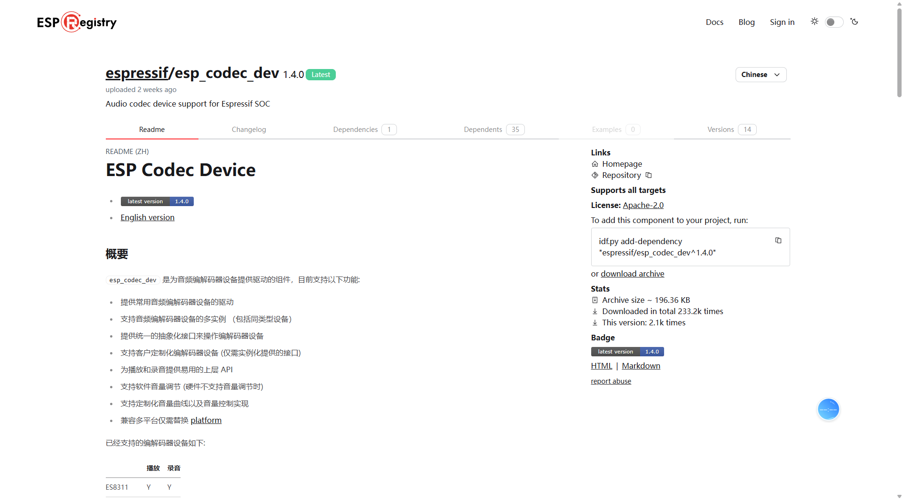

# ES8311

#  组件安装
## 搜索组件

 [ESP Component Registry](https://components.espressif.com/) 



## 下载组件
在终端执行这个命令,并重新编译

```c
idf.py add-dependency "espressif/esp_codec_dev^1.3.4"
```

## 使用组件
重新编译即可

# 驱动实现
## Int_ES8311.h
```c
#ifndef __INT_ES8311_H__
#define __INT_ES8311_H__
// 防止头文件被重复包含（预处理指令：如果未定义__INT_ES8311_H__，则定义并包含以下内容）

// -------------------------- 引入依赖头文件 --------------------------
#include "esp_idf_version.h"       // ESP-IDF 版本信息（用于版本兼容处理）

#include "driver/i2s_std.h"        // I2S 标准模式驱动（音频数据传输接口）
#include "driver/i2s_tdm.h"        // I2S TDM 模式驱动（可选，此处未使用但预留兼容）
#include "soc/soc_caps.h"          // 芯片功能特性定义（用于判断硬件支持的功能）

#include "esp_codec_dev.h"         // ESP 编解码器设备抽象层（统一管理音频设备）
#include "esp_codec_dev_defaults.h"// 编解码器设备默认配置（提供默认实现）
#include "unity.h"                 // 单元测试框架（可能用于驱动测试，实际应用可移除）
#include "es8311_codec.h"          // ES8311 编解码器专用驱动（包含芯片特有操作）

#include "driver/i2c.h"            // I2C 驱动（用于配置 ES8311 寄存器）
#include "driver/gpio.h"           // GPIO 驱动（用于控制硬件引脚，如功放使能）

// -------------------------- 硬件引脚宏定义 --------------------------
// I2C 控制接口引脚定义（连接 ES8311 的 I2C 控制端）
#define ES8311_I2C_SDA_PIN      GPIO_NUM_0   // I2C 数据引脚（SDA）
#define ES8311_I2C_SCL_PIN      GPIO_NUM_1   // I2C 时钟引脚（SCL）

// I2S 音频数据接口引脚定义（连接 ES8311 的音频数据端）
#define ES8311_I2S_BCK_PIN      GPIO_NUM_2   // I2S 位时钟引脚（Bit Clock）
#define ES8311_I2S_MCK_PIN      GPIO_NUM_3   // I2S 主时钟引脚（Master Clock）
#define ES8311_I2S_DATA_IN_PIN  GPIO_NUM_4   // I2S 数据输入引脚（麦克风数据到 ESP32）
#define ES8311_I2S_DATA_OUT_PIN GPIO_NUM_6   // I2S 数据输出引脚（ESP32 数据到扬声器）
#define ES8311_I2S_DATA_WS_PIN  GPIO_NUM_5   // I2S 声道选择引脚（Word Select，左右声道切换）

// 功放控制引脚定义
#define ES8311_PA_PIN GPIO_NUM_46  // 扬声器功放（Power Amplifier）使能引脚

// -------------------------- 函数声明（对外接口） --------------------------
/**
 * @brief ES8311 初始化函数
 * @details 完成 I2C、I2S 接口初始化，配置 ES8311 工作参数并启动设备
 * @note 必须在使用音频功能前调用，且仅需调用一次
 */
void Int_ES8311_Init(void);

/**
 * @brief ES8311 取消初始化函数
 * @details 关闭设备，释放 I2C、I2S 资源，恢复引脚默认状态
 * @note 在设备不再使用时调用，避免资源泄露
 */
void Int_ES8311_DeInit(void);

/**
 * @brief 从麦克风读取音频数据
 * @param data 输出参数：存储读取到的音频数据缓冲区（16bit 单声道，小端格式）
 * @param len  输入参数：需要读取的数据长度（单位：字节，需为 2 的倍数）
 * @note 数据格式需与初始化时配置的采样参数（16000Hz、16bit）匹配
 */
void Int_ES8311_ReadFromMic(uint8_t data[], size_t len);

/**
 * @brief 向扬声器写入音频数据
 * @param data 输入参数：待播放的音频数据缓冲区（16bit 单声道，小端格式）
 * @param len  输入参数：需要写入的数据长度（单位：字节，需为 2 的倍数）
 * @note 数据格式需与初始化时配置的采样参数一致，否则可能产生噪音
 */
void Int_ES8311_WriteToSpeaker(uint8_t data[], size_t len);

#endif /* __INT_ES8311_H__ */
// 头文件结束标记
```

## Int_ES8311.c
```c
#include "Int_ES8311.h"

// -------------------------- 全局变量定义 --------------------------
// ES8311 编解码器设备句柄：用于后续操作（如音量控制、采样率配置、数据读写）
esp_codec_dev_handle_t codec_dev;

// I2S 音频通道句柄：
// speaker_tx_handler：音频输出通道（连接扬声器/功放，发送音频数据）
// mic_rx_handler：音频输入通道（连接麦克风，接收音频数据）
i2s_chan_handle_t speaker_tx_handler;
i2s_chan_handle_t mic_rx_handler;

/**
 * @brief I2C 初始化（ES8311 控制接口）
 * @note ES8311 需通过 I2C 接口配置内部寄存器（如音量、采样率、工作模式），此函数初始化 I2C 主机
 */
static void Int_ES8311_I2C_Init(void)
{
    // I2C 配置结构体：配置 I2C 主机模式、引脚、速率等参数
    i2c_config_t i2c_cfg = {
        .mode = I2C_MODE_MASTER,             // 工作模式：I2C 主机（ESP32 控制 ES8311）
        .sda_pullup_en = GPIO_PULLUP_ENABLE, // 使能 SDA 引脚内部上拉（避免信号不稳定）
        .scl_pullup_en = GPIO_PULLUP_ENABLE, // 使能 SCL 引脚内部上拉
        .master.clk_speed = 100000,          // I2C 通信速率：100kHz（ES8311 支持的标准速率）
        .sda_io_num = ES8311_I2C_SDA_PIN,    // SDA 引脚（需在 Int_ES8311.h 中定义具体 GPIO 号）
        .scl_io_num = ES8311_I2C_SCL_PIN,    // SCL 引脚（需在 Int_ES8311.h 中定义具体 GPIO 号）
    };

    // 应用 I2C 配置到指定 I2C 端口（此处为 I2C_NUM_0）
    i2c_param_config(I2C_NUM_0, &i2c_cfg);

    // 安装 I2C 驱动：参数依次为「I2C 端口、模式、接收缓存大小、发送缓存大小、中断优先级」
    // 此处缓存设为 0（无缓冲，直接读写），中断优先级默认
    i2c_driver_install(I2C_NUM_0, i2c_cfg.mode, 0, 0, 0);
}

/**
 * @brief I2C 取消初始化（释放资源）
 * @note 关闭 I2C 驱动并释放占用的 GPIO 引脚，仅在设备销毁时调用
 */
static void Int_ES8311_I2C_DeInit(void)
{
    // 卸载 I2C 驱动，释放 I2C_NUM_0 端口资源
    i2c_driver_delete(I2C_NUM_0);
}

/**
 * @brief I2S 初始化（ES8311 音频数据接口）
 * @note I2S 是音频专用同步串行接口，用于 ESP32 与 ES8311 之间传输音频数据流（麦克风输入/扬声器输出）
 */
static void Int_ES8311_I2S_Init(void)
{
    // 1. 配置 I2S 通道基础参数
    i2s_chan_config_t chan_cfg = I2S_CHANNEL_DEFAULT_CONFIG(
        I2S_NUM_0,      // 使用的 I2S 端口号（I2S_NUM_0）
        I2S_ROLE_MASTER // ESP32 作为 I2S 主机（生成时钟信号，控制数据传输时序）
    );

    // 2. 配置 I2S 标准时序（飞利浦标准，ES8311 支持）
    i2s_std_config_t std_cfg = {
        // 时钟配置：使用默认时钟生成函数，采样率设为 16000Hz（常用语音采样率，兼顾音质与数据量）
        .clk_cfg = I2S_STD_CLK_DEFAULT_CONFIG(16000),

        // 时隙配置：飞利浦标准时隙，每个声道数据位宽 16bit，工作模式为单声道（MONO）
        // 注：若需立体声，需改为 I2S_SLOT_MODE_STEREO，并调整后续采样配置
        .slot_cfg = I2S_STD_PHILIPS_SLOT_DEFAULT_CONFIG(16, I2S_SLOT_MODE_MONO),

        // GPIO 引脚配置：绑定 I2S 相关信号引脚（需在 Int_ES8311.h 中定义具体 GPIO 号）
        .gpio_cfg = {
            .mclk = ES8311_I2S_MCK_PIN,      // 主时钟引脚（MCLK，用于 ES8311 内部时钟同步）
            .bclk = ES8311_I2S_BCK_PIN,      // 位时钟引脚（BCK，每传输 1bit 数据切换一次）
            .ws = ES8311_I2S_DATA_WS_PIN,    // 声道选择引脚（WS，切换左右声道/区分输入输出）
            .dout = ES8311_I2S_DATA_OUT_PIN, // 数据输出引脚（ESP32 → ES8311，用于扬声器播放）
            .din = ES8311_I2S_DATA_IN_PIN,   // 数据输入引脚（ES8311 → ESP32，用于麦克风录音）
        },
    };

    // 3. 创建 I2S 双声道（发送+接收）：根据 chan_cfg 生成 TX（输出）和 RX（输入）通道句柄
    // 注：I2S_NUM_0 支持同时创建 TX 和 RX 通道，实现全双工（同时录音+播放）
    i2s_new_channel(&chan_cfg, &speaker_tx_handler, &mic_rx_handler);

    // 4. 初始化 I2S 通道：将标准时序配置（std_cfg）绑定到 TX/RX 通道
    i2s_channel_init_std_mode(speaker_tx_handler, &std_cfg); // 初始化扬声器输出通道
    i2s_channel_init_std_mode(mic_rx_handler, &std_cfg);     // 初始化麦克风输入通道

    // 5. 使能 I2S 通道：通道初始化完成后需手动使能，才能开始数据传输
    i2s_channel_enable(speaker_tx_handler);
    i2s_channel_enable(mic_rx_handler);
}

/**
 * @brief I2S 取消初始化（释放资源）
 * @note 先禁用通道，再删除通道句柄，释放 I2S 端口和 GPIO 资源
 */
static void Int_ES8311_I2S_DeInit(void)
{
    // 1. 禁用 I2S 通道（停止数据传输）
    // i2s_channel_disable(speaker_tx_handler);
    // i2s_channel_disable(mic_rx_handler);

    // 2. 删除 I2S 通道句柄（释放通道资源）
    i2s_del_channel(speaker_tx_handler);
    i2s_del_channel(mic_rx_handler);
}

/**
 * @brief ES8311 设备初始化（核心函数）
 * @note 整合 I2C 控制接口、I2S 数据接口，完成 ES8311 硬件配置与设备句柄创建
 */
static void Int_ES8311_Dev_Init(void)
{
    // -------------------------- 步骤1：创建 I2S 数据接口 --------------------------
    // 配置 I2S 数据接口参数：绑定 TX/RX 通道句柄
    audio_codec_i2s_cfg_t i2s_cfg = {
        .rx_handle = mic_rx_handler,     // 绑定麦克风输入通道（数据从 ES8311 到 ESP32）
        .tx_handle = speaker_tx_handler, // 绑定扬声器输出通道（数据从 ESP32 到 ES8311）
    };
    // 创建 I2S 数据接口对象：用于后续与 ES8311 的音频数据流交互
    const audio_codec_data_if_t *data_if = audio_codec_new_i2s_data(&i2s_cfg);

    // -------------------------- 步骤2：创建 I2C 控制接口 --------------------------
    // 配置 I2C 控制接口参数：指定 I2C 端口和 ES8311 设备地址
    audio_codec_i2c_cfg_t i2c_cfg = {
        .port = I2C_NUM_0,                 // 使用的 I2C 端口（与 Int_ES8311_I2C_Init 一致）
        .addr = ES8311_CODEC_DEFAULT_ADDR, // ES8311 默认 I2C 设备地址（通常为 0x10 或 0x11，需与硬件匹配）
    };
    // 创建 I2C 控制接口对象：用于向 ES8311 写入寄存器配置（如音量、模式）
    const audio_codec_ctrl_if_t *out_ctrl_if = audio_codec_new_i2c_ctrl(&i2c_cfg);

    // -------------------------- 步骤3：创建 GPIO 接口 --------------------------
    // 创建 GPIO 接口对象：用于控制 ES8311 硬件引脚（如 PA 使能引脚）
    const audio_codec_gpio_if_t *gpio_if = audio_codec_new_gpio();

    // -------------------------- 步骤4：配置 ES8311 编解码器参数 --------------------------
    es8311_codec_cfg_t es8311_cfg = {
        .codec_mode = ESP_CODEC_DEV_WORK_MODE_BOTH, // 工作模式：同时支持输入（录音）和输出（播放）
        .ctrl_if = out_ctrl_if,                     // 绑定 I2C 控制接口（用于配置寄存器）
        .gpio_if = gpio_if,                         // 绑定 GPIO 接口（用于控制硬件引脚）
        .pa_pin = ES8311_PA_PIN,                    // 功放（PA）使能引脚（控制扬声器功放开关，需在头文件定义）
        .use_mclk = true,                           // 使能 MCLK（主时钟，ES8311 需 MCLK 同步内部时序）
    };
    // 创建 ES8311 编解码器接口对象：封装 ES8311 特有操作（如寄存器配置、模式切换）
    const audio_codec_if_t *out_codec_if = es8311_codec_new(&es8311_cfg);

    // -------------------------- 步骤5：创建设备句柄并初始化 --------------------------
    // 配置 ES8311 设备参数
    esp_codec_dev_cfg_t dev_cfg = {
        .codec_if = out_codec_if,              // 绑定 ES8311 编解码器接口
        .data_if = data_if,                    // 绑定 I2S 数据接口
        .dev_type = ESP_CODEC_DEV_TYPE_IN_OUT, // 设备类型：同时支持输入（IN）和输出（OUT）
    };
    // 创建设备句柄：codec_dev 是后续操作 ES8311 的核心句柄
    codec_dev = esp_codec_dev_new(&dev_cfg);

    // -------------------------- 步骤6：配置音频参数 --------------------------
    // 1. 设置输出音量和输入增益（单位：dB）
    esp_codec_dev_set_out_vol(codec_dev, 60.0); // 扬声器输出音量：60dB（范围需参考 ES8311 手册，避免失真）
    esp_codec_dev_set_in_gain(codec_dev, 20.0); // 麦克风输入增益：20dB（根据环境调整，避免噪音或信号过弱）

    // 2. 配置采样参数（需与 I2S 初始化的采样率、位宽一致）
    esp_codec_dev_sample_info_t fs = {
        .sample_rate = 16000,                               // 采样率：16000Hz（与 I2S_STD_CLK_DEFAULT_CONFIG 一致）
        .channel = 1,                                       // 通道数：1（单声道，与 I2S_SLOT_MODE_MONO 一致）
        .channel_mask = ESP_CODEC_DEV_MAKE_CHANNEL_MASK(0), // 通道掩码：选择第 0 通道（单声道默认）
        .bits_per_sample = 16,                              // 采样位宽：16bit（与 I2S_STD_PHILIPS_SLOT 一致）
        .mclk_multiple = 256,                               // MCLK 倍频系数：256×采样率（ES8311 推荐配置，确保时钟稳定）
    };

    // -------------------------- 步骤7：启动 ES8311 设备 --------------------------
    // 打开设备并应用采样参数，此时 ES8311 进入工作状态，可开始录音/播放
    esp_codec_dev_open(codec_dev, &fs);
}

/**
 * @brief ES8311 设备取消初始化（释放资源）
 * @note 关闭设备并释放编解码器接口资源，需在 I2C/I2S 取消初始化前调用
 */
static void Int_ES8311_Dev_DeInit(void)
{
    // 关闭 ES8311 设备（停止录音/播放，复位内部状态）
    esp_codec_dev_close(codec_dev);
    // 注：若需完全释放资源，可在此处添加 esp_codec_dev_delete(codec_dev)（需确认无其他模块引用该句柄）
}

/**
 * @brief ES8311 总初始化函数（对外接口）
 * @note 按「I2C → I2S → 设备配置」的顺序初始化，确保依赖资源依次就绪
 */
void Int_ES8311_Init(void)
{
    // 1. 初始化 I2C（先初始化控制接口，为后续设备配置做准备）
    Int_ES8311_I2C_Init();

    // 2. 初始化 I2S（再初始化数据接口，确保数据传输通道就绪）
    Int_ES8311_I2S_Init();

    // 3. 初始化 ES8311 设备（最后配置硬件参数，启动设备）
    Int_ES8311_Dev_Init();
}

/**
 * @brief ES8311 总取消初始化函数（对外接口）
 * @note 按「设备关闭 → I2S 释放 → I2C 释放」的顺序销毁，避免资源依赖冲突
 */
void Int_ES8311_DeInit(void)
{
    // 1. 先关闭 ES8311 设备（停止工作，避免数据传输中释放资源）
    Int_ES8311_Dev_DeInit();

    // 3. 最后释放 I2C 资源（控制接口无后续操作）
    Int_ES8311_I2C_DeInit();

    // 2. 再释放 I2S 资源（数据接口依赖设备已关闭）
    Int_ES8311_I2S_DeInit();
}

/**
 * @brief 从麦克风读取音频数据（对外接口）
 * @param data 数据缓冲区：存储读取到的麦克风音频数据（16bit 单声道，小端格式）
 * @param len  读取长度：缓冲区大小（单位：字节，需为 2 的倍数，因每个采样点 16bit=2 字节）
 * @note 需确保缓冲区非空且 codec_dev 已初始化，否则函数无操作
 */
void Int_ES8311_ReadFromMic(uint8_t data[], size_t len)
{
    // 合法性检查：设备句柄非空 + 读取长度大于 0
    if (codec_dev != NULL && len > 0)
    {
        // 从 ES8311 麦克风输入通道读取数据（通过 codec_dev 句柄封装 I2S 读操作）
        esp_codec_dev_read(codec_dev, data, len);
    }
}

/**
 * @brief 向扬声器写入音频数据（对外接口）
 * @param data 数据缓冲区：待播放的音频数据（16bit 单声道，小端格式，需与采样参数匹配）
 * @param len  写入长度：缓冲区大小（单位：字节，需为 2 的倍数）
 * @note 需确保缓冲区非空且 codec_dev 已初始化，否则函数无操作
 */
void Int_ES8311_WriteToSpeaker(uint8_t data[], size_t len)
{
    // 合法性检查：设备句柄非空 + 写入长度大于 0
    if (codec_dev != NULL && len > 0)
    {
        // 向 ES8311 扬声器输出通道写入数据（通过 codec_dev 句柄封装 I2S 写操作）
        esp_codec_dev_write(codec_dev, data, len);
    }
}
```


## main中测试
```c
#include <stdio.h>
#include "Int/Int_ES8311.h"

void app_main(void)
{
    // 1. 初始化ES8311
    Int_ES8311_Init();

    // 2. 不断的从Mic中读取数据,然后直接交给扬声器播放
    uint8_t data[1024] = {0};

    while (1)
    {
        Int_ES8311_ReadFromMic(data, 1024);
        Int_ES8311_WriteToSpeaker(data, 1024);

        vTaskDelay(10);
    }
}

```

## 使用旧版本I2C的组件
**方法一:**

1. 检查`menuconfig`配置

```c
idf.py menuconfig
```

2. 选择


3. 选择


4. 选择


**方法二:**

使用需要 SDK配置 中勾选


