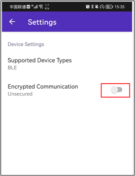

# 配网

如果要实现音视频信息的实时推送和接收, 必须先连接网络.  在门锁项目中,我们是在项目中把wifi的ssid和密码写死的, 这在实际的产品中是不可行的!

由于每个用户要连接的wifi是不同的, 必须给用户提供自助选择ssid和输入密码的功能

# 配网方式
esp提供了2种配网方式:

（1）Wi-Fi（SoftAP + HTTP 服务器）

就是先在esp中开启wifi热点, 并启动一个http服务器. 手机wifi连接这个热点, 然后访问http服务器提供的配网页面, 在页面中选择esp将来要连接的wifi ap, 并填写密码. 然后重启esp, esp就会连接刚刚配置的WiFi了

（2）**低功耗蓝牙（基于 GATT）传输方式。**

就是通过蓝牙把相应的wifi信息传输给esp32

**<font style="color:red;">选择使用低功耗蓝牙配网</font>**

## 下载esp专用的手机配网app
下载地址: 

Android:

[https://github.com/espressif/esp-idf-provisioning-android/releases/download/Provisioning_App_Release_2.2.0/ESP_BLE_Prov_2_2_0.apk](https://github.com/espressif/esp-idf-provisioning-android/releases/download/Provisioning_App_Release_2.2.0/ESP_BLE_Prov_2_2_0.apk)

IOS: 

[https://apps.apple.com/in/app/esp-ble-provisioning/id1473590141](https://apps.apple.com/in/app/esp-ble-provisioning/id1473590141)

# 用户配置


# 示例代码


# 安装组件


# 代码
## Dri_WIFI.c
```c
#ifndef __DRI_WIFI_H__
#define __DRI_WIFI_H__
// 头文件保护宏：防止因多次包含导致函数/类型重复定义
// 原理：首次包含时定义 __DRI_WIFI_H__，后续包含时因宏已存在而跳过内容


// -------------------------- 依赖头文件引入 --------------------------
// 1. 标准库头文件：提供基础输入输出、字符串处理功能
#include <stdio.h>    // 标准输入输出（如日志打印依赖的格式化函数）
#include <string.h>   // 字符串操作（如内存拷贝、长度计算）

// 2. FreeRTOS 头文件：提供实时操作系统核心功能（任务、事件组）
#include <freertos/FreeRTOS.h>   // FreeRTOS 核心定义（如任务调度基础）
#include <freertos/task.h>       // 任务管理（如任务创建、删除）
#include <freertos/event_groups.h> // 事件组（用于 WiFi 连接状态同步）

// 3. ESP-IDF 核心驱动头文件：WiFi、事件、NVS 等硬件/系统功能
#include <esp_log.h>     // ESP 日志系统（用于打印调试/信息日志）
#include <esp_wifi.h>    // WiFi 驱动核心（WiFi 模式配置、连接控制）
#include <esp_event.h>   // 事件循环（用于监听 WiFi 配网/连接事件）
#include <nvs_flash.h>   // NVS 非易失性存储（保存配网后的 WiFi 凭据）

// 4. WiFi 配网专用头文件：ESP-IDF 配网管理器与 BLE 配网方案
#include <wifi_provisioning/manager.h> // 配网管理器（统一管理配网流程）
#include <wifi_provisioning/scheme_ble.h> // BLE 配网方案（通过蓝牙传输 WiFi 凭据）

// 5. 二维码生成头文件：用于生成配网二维码（供手机 App 扫描）
#include "qrcode.h"


// -------------------------- 回调函数类型定义 --------------------------
/**
 * @brief WiFi 配网成功回调函数类型
 * @note 定义一个无参数、无返回值的函数指针类型，用于在配网成功后触发自定义逻辑
 * @example 可在回调中实现「连接成功后启动业务任务」「打印连接信息」等操作
 */
typedef void (*wifi_cb)(void);

// -------------------------- 对外函数声明 --------------------------
/**
 * @brief WiFi 配网初始化函数（对外核心接口）
 * @param cb 配网成功后的回调函数指针，配网+WiFi连接成功后自动调用
 * @note 关键特性说明：
 *       1. 配网传输方式：使用 BLE（蓝牙低功耗），需通过手机 ESP Provisioning App 扫描配网
 *       2. 凭据存储：配网成功后，WiFi 账号密码会保存在 NVS 中，下次启动自动连接
 *       3. 重试机制：配网失败/连接失败时会自动重试，超过阈值后重置配网状态
 *       4. 状态同步：通过事件组等待 WiFi 连接成功，确保初始化完成后再执行后续逻辑
 */
void Dri_WIFI_Init(wifi_cb cb);

#endif /* __DRI_WIFI_H__ */
// 头文件结束标记：与开头的 #ifndef 配对，结束头文件保护逻辑
```


## Dri_WIFI.h
```c
#ifndef __DRI_WIFI_H__
#define __DRI_WIFI_H__
// 头文件保护宏：防止因多次包含导致函数/类型重复定义
// 原理：首次包含时定义 __DRI_WIFI_H__，后续包含时因宏已存在而跳过内容


// -------------------------- 依赖头文件引入 --------------------------
// 1. 标准库头文件：提供基础输入输出、字符串处理功能
#include <stdio.h>    // 标准输入输出（如日志打印依赖的格式化函数）
#include <string.h>   // 字符串操作（如内存拷贝、长度计算）

// 2. FreeRTOS 头文件：提供实时操作系统核心功能（任务、事件组）
#include <freertos/FreeRTOS.h>   // FreeRTOS 核心定义（如任务调度基础）
#include <freertos/task.h>       // 任务管理（如任务创建、删除）
#include <freertos/event_groups.h> // 事件组（用于 WiFi 连接状态同步）

// 3. ESP-IDF 核心驱动头文件：WiFi、事件、NVS 等硬件/系统功能
#include <esp_log.h>     // ESP 日志系统（用于打印调试/信息日志）
#include <esp_wifi.h>    // WiFi 驱动核心（WiFi 模式配置、连接控制）
#include <esp_event.h>   // 事件循环（用于监听 WiFi 配网/连接事件）
#include <nvs_flash.h>   // NVS 非易失性存储（保存配网后的 WiFi 凭据）

// 4. WiFi 配网专用头文件：ESP-IDF 配网管理器与 BLE 配网方案
#include <wifi_provisioning/manager.h> // 配网管理器（统一管理配网流程）
#include <wifi_provisioning/scheme_ble.h> // BLE 配网方案（通过蓝牙传输 WiFi 凭据）

// 5. 二维码生成头文件：用于生成配网二维码（供手机 App 扫描）
#include "qrcode.h"


// -------------------------- 回调函数类型定义 --------------------------
/**
 * @brief WiFi 配网成功回调函数类型
 * @note 定义一个无参数、无返回值的函数指针类型，用于在配网成功后触发自定义逻辑
 * @example 可在回调中实现「连接成功后启动业务任务」「打印连接信息」等操作
 */
typedef void (*wifi_cb)(void);

// -------------------------- 对外函数声明 --------------------------
/**
 * @brief WiFi 配网初始化函数（对外核心接口）
 * @param cb 配网成功后的回调函数指针，配网+WiFi连接成功后自动调用
 * @note 关键特性说明：
 *       1. 配网传输方式：使用 BLE（蓝牙低功耗），需通过手机 ESP Provisioning App 扫描配网
 *       2. 凭据存储：配网成功后，WiFi 账号密码会保存在 NVS 中，下次启动自动连接
 *       3. 重试机制：配网失败/连接失败时会自动重试，超过阈值后重置配网状态
 *       4. 状态同步：通过事件组等待 WiFi 连接成功，确保初始化完成后再执行后续逻辑
 */
void Dri_WIFI_Init(wifi_cb cb);

#endif /* __DRI_WIFI_H__ */
// 头文件结束标记：与开头的 #ifndef 配对，结束头文件保护逻辑
```

# 下载软件
下载地址: 

Android:

[https://github.com/espressif/esp-idf-provisioning-android/releases/download/Provisioning_App_Release_2.2.0/ESP_BLE_Prov_2_2_0.apk](https://github.com/espressif/esp-idf-provisioning-android/releases/download/Provisioning_App_Release_2.2.0/ESP_BLE_Prov_2_2_0.apk)

IOS: 

[https://apps.apple.com/in/app/esp-ble-provisioning/id1473590141](https://apps.apple.com/in/app/esp-ble-provisioning/id1473590141)


# 使用手机app进行配网
程序启动后, 会在控制台打印二维码, 每台设备的二维码是唯一的


打开手机app, 关掉安全通信(我们在代码中设置的安全级别为0)



然后扫描二维码, 输入要连接的wifi和密码, 就可以配网成功了.  Wifi名和密码会存在nvs中,以后就会自动读取了

## main.c
```c
#include <stdio.h>
#include "Int/Int_ES8311.h"
#include "Dri/Dri_Wifi.h"

// WIFI创建成功的回调函数
void wifi_succ_cb(void)
{
    printf("\r\n");
    MY_LOGE("wifi is Connected....\r\n");

    // 初始化 MQTT
    Dri_MQTT_Init();

    // 初始化 websocket 客户端
    App_WS_Init();
}

void app_main(void)
{
    Dri_WIFI_Init(wifi_succ_cb);

    while (1)
    {

        vTaskDelay(10);
    }
}

```

