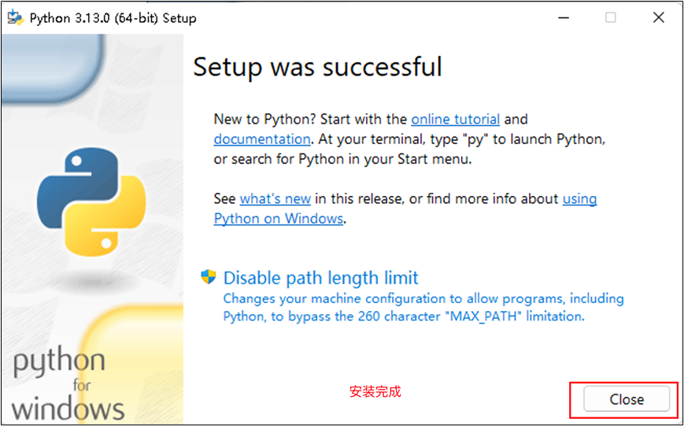

# MQTT模块

# MQTT协议
## MQTT协议介绍
MQTT（Message Queuing Telemetry Transport）是一种轻量级的消息传输协议，专为远程设备和物联网（IoT）应用设计。

它是一个基于<font style="color:red;">发布</font><font style="color:red;">/</font><font style="color:red;">订阅（</font><font style="color:red;">Publish/Subscribe</font><font style="color:red;">）模式</font>的协议，具有**<font style="color:red;">高效、可靠、低带宽和低功耗</font>**等特点，广泛应用于需要远程监控、实时通信和事件驱动的场景。

MQTT 最初由 IBM 在 1999 年开发，旨在解决远程环境下通信的问题，特别适用于带宽有限、网络质量不稳定的条件。随着物联网（IoT）发展，MQTT 在现代设备间的消息传递中成为重要的<font style="color:red;">标准协议</font>。

通信模型为**发布,订阅**模型，而非传统的客户端/服务器模型。设备可以是消息的发布者（Publisher）或订阅者（Subscriber），通过一个中央代理（Broker）来传递消息。

##  MQTT 协议的组成部分
+ **MQTT 客户端**：

MQTT 客户端是连接到代理并使用 MQTT 协议进行通信的设备或应用程序。它可以是任何设备，通常是 IoT 设备、传感器、网关、应用程序等。

+ **MQTT 代理（Broker）**：

代理是中介服务器，负责接收、存储和转发消息。代理管理所有客户端的连接、主题和消息的转发。

代理确保了消息的发布、订阅和质量控制。

+ **主题（Topic）**

主题是消息的路由标识，类似于频道。客户端通过主题进行消息的发布和订阅，主题结构是层次化的，用`/`分隔。  

例如：`home/livingroom/temperature`，表示家庭中客厅的温度。

+ **消息（Message）**：

每个 MQTT 消息都与一个主题相关联，包含消息内容、质量等级、消息保持标志等元数据。

## MQTT 协议的工作原理
MQTT 基于客户端-代理（Broker）的架构, 工作流程如下：

1. 连接建立

客户端（例如 IoT 设备或应用程序）通过 TCP/IP 或 TLS 等协议连接到 MQTT 代理（Broker）。

客户端通过 CONNECT 消息建立连接，并向代理发送认证信息（如用户名、密码等）。

2. 消息订阅

客户端作为订阅者（Subscriber），可以订阅一个或多个主题。每当有新的消息发布到订阅的主题时，代理会将消息转发给订阅者。

订阅的主题可以是具体的名称，也可以使用通配符来匹配多个主题，例如 home/+/temperature（+ 表示任意单层路径）。

3. 消息发布：

客户端作为发布者（Publisher），可以将消息发布到一个主题（Topic）。主题类似于一个频道，消息是发送到该主题的。

发布消息时，客户端指定一个主题，消息内容由发布者提供。主题名是层次化的，可以像文件路径一样使用 / 进行分隔，例如 home/livingroom/temperature。

4. 消息传输：

代理会接收所有发布到主题的消息，并转发给所有已订阅该主题的客户端。

客户端之间的通信不直接进行，所有的消息通过代理中转，从而实现解耦。

5. 连接断开：

客户端可以通过发送 DISCONNECT 消息来断开连接。

客户端（订阅者）与代理的连接是持久的，直到明确断开。

## MQTT 协议的应用场景
MQTT 协议非常适合以下应用场景：

1. 物联网（IoT）：

在 IoT 应用中，MQTT 被广泛用于传感器数据的收集、远程控制和设备管理。智能家居、智能农业、环境监测等都可以使用 MQTT。

2. 智能家居：

智能家居设备之间的通信，如智能灯泡、温湿度传感器、门锁等，常使用 MQTT 来传递消息。

3. 实时数据传输：

用于实时数据流的传输，如车辆监控、设备远程控制等。

4. 远程监控：

在远程环境下，MQTT 可以用于设备的状态监控和控制指令的发送。

5. 移动应用：

适用于需要低带宽和低功耗的移动应用，例如移动设备之间的通信。

6. 健康医疗：

远程病患监测、健康数据传输等场景中，MQTT 可以实现低延迟、可靠的数据传输。

# MQTT代码


## Dri_MQTT.c
```c
#include "Dri_MQTT.h"
static const char *TAG = "mqtt";

// app_main任务句柄
extern TaskHandle_t main_task_handle;

/**
 * @brief 数据接收成功的处理函数
 */
void Dri_MQTT_Data_Handle(char *data)
{
    // 1. 使用CJson 把json字符串转为Json对象
    cJSON *root = cJSON_Parse(data);
    cJSON *cmd_obj = cJSON_GetObjectItem(root, "cmd");
    cJSON *type_obj = cJSON_GetObjectItem(root, "type");
    cJSON *dir_obj = cJSON_GetObjectItem(root, "dir");

    // 2. 拿到json对象的每一个字符串
    char *cmd = cJSON_GetStringValue(cmd_obj);
    char *type = cJSON_GetStringValue(type_obj);
    char *dir = cJSON_GetStringValue(dir_obj);

    MY_LOGI("cmd = %s,type = %s,dir = %s", cmd, type, dir);

    // 初始化一个通知值
    uint8_t action = MQTT_ACTION_AUDIO_VIDEO_NO;

    // 3. 对数据进行分类
    if (strcmp(type, "audio") == 0)
    {
        if (strcmp(cmd, "on") == 0)
        {
            if (strcmp(dir, "client2esp") == 0)
            {
                action = MQTT_ACTION_AUDIO_CLIENT2ESP_ON;
            }
            else if (strcmp(dir, "esp2client") == 0)
            {
                action = MQTT_ACTION_AUDIO_ESP2CLIENT_ON;
            }
        }
        else if (strcmp(cmd, "off") == 0)
        {
            if (strcmp(dir, "client2esp") == 0)
            {
                action = MQTT_ACTION_AUDIO_CLIENT2ESP_OFF;
            }
            else if (strcmp(dir, "esp2client") == 0)
            {
                action = MQTT_ACTION_AUDIO_ESP2CLIENT_OFF;
            }
        }
    }
    else if (strcmp(type, "video") == 0)
    {
        if (strcmp(cmd, "on") == 0)
        {
            action = MQTT_ACTION_VIDEO_ESP2CLIENT_ON;
        }
        else if (strcmp(cmd, "off") == 0)
        {
            action = MQTT_ACTION_VIDEO_ESP2CLIENT_OFF;
        }
    }

    // 发送通知给main任务
    xTaskNotify(app_main_handle, action, eSetValueWithOverwrite);
}

// MQTT回调函数
static void mqtt_event_handler(void *handler_args, esp_event_base_t base, int32_t event_id, void *event_data)
{
    esp_mqtt_event_handle_t event = event_data;
    esp_mqtt_client_handle_t client = event->client;
    int msg_id;
    switch ((esp_mqtt_event_id_t)event_id)
    {
    case MQTT_EVENT_CONNECTED:
        ESP_LOGI(TAG, "MQTT_EVENT_CONNECTED");
        msg_id = esp_mqtt_client_subscribe(client, "guo/cmd", 0);
        ESP_LOGI(TAG, "sent subscribe successful, msg_id=%d", msg_id);
        break;
    case MQTT_EVENT_DISCONNECTED:
        ESP_LOGI(TAG, "MQTT_EVENT_DISCONNECTED");
        break;
    case MQTT_EVENT_SUBSCRIBED:
        ESP_LOGI(TAG, "MQTT_EVENT_SUBSCRIBED, msg_id=%d", event->msg_id);
        msg_id = esp_mqtt_client_publish(client, "/topic/qos0", "data", 0, 0, 0);
        break;
    case MQTT_EVENT_UNSUBSCRIBED:
        ESP_LOGI(TAG, "MQTT_EVENT_UNSUBSCRIBED, msg_id=%d", event->msg_id);
        break;
    case MQTT_EVENT_PUBLISHED:
        ESP_LOGI(TAG, "MQTT_EVENT_PUBLISHED, msg_id=%d", event->msg_id);
        break;
    case MQTT_EVENT_DATA:
        ESP_LOGI(TAG, "MQTT_EVENT_DATA");
        // printf("TOPIC=%.*s\r\n", event->topic_len, event->topic);
        // printf("DATA=%.*s\r\n", event->data_len, event->data);
        Dri_MQTT_Data_Handle(event->data);
        break;
    case MQTT_EVENT_ERROR:
        ESP_LOGI(TAG, "MQTT_EVENT_ERROR");
        break;
    default:
        ESP_LOGI(TAG, "Other event id:%d", event->event_id);
        break;
    }
}

/**
 * @brief MQTT初始化
 */
void Dri_MQTT_Init(void)
{
    // MQTT服务端配置
    const esp_mqtt_client_config_t mqtt_cfg = {
        .broker.address.uri = "ws://broker.emqx.io:8083/mqtt",
    };

    // 初始化MQTT配置
    esp_mqtt_client_handle_t client = esp_mqtt_client_init(&mqtt_cfg);

    // 注册MQTT回调函数
    esp_mqtt_client_register_event(client, ESP_EVENT_ANY_ID, mqtt_event_handler, NULL);

    // 启动MQTT
    esp_mqtt_client_start(client);
}
```


## Dri_MQTT.h
```c
#ifndef __DRI_MQTT_H__
#define __DRI_MQTT_H__

#include <stdio.h>
#include <stdint.h>
#include <stddef.h>
#include <string.h>
#include "esp_wifi.h"
#include "esp_system.h"
#include "nvs_flash.h"
#include "esp_event.h"
#include "esp_netif.h"

#include "freertos/FreeRTOS.h"
#include "freertos/task.h"
#include "freertos/semphr.h"
#include "freertos/queue.h"

#include "lwip/sockets.h"
#include "lwip/dns.h"
#include "lwip/netdb.h"

#include "esp_log.h"
#include "mqtt_client.h"

#include "cJSON.h"
#include "Com_Debug.h"

#define MQTT_ACTION_AUDIO_VIDEO_NO 0
#define MQTT_ACTION_AUDIO_CLIENT2ESP_ON 1
#define MQTT_ACTION_AUDIO_CLIENT2ESP_OFF 2
#define MQTT_ACTION_AUDIO_ESP2CLIENT_ON 3
#define MQTT_ACTION_AUDIO_ESP2CLIENT_OFF 4
#define MQTT_ACTION_VIDEO_ESP2CLIENT_ON 5
#define MQTT_ACTION_VIDEO_ESP2CLIENT_OFF 6

// app_main 的任务句柄
extern TaskHandle_t app_main_handle;

/**
 * @brief MQTT 初始化
 * 
 */
void Dri_MQTT_Init(void);


#endif /* __DRI_MQTT_H__ */
```


## main.c
```c
#include <stdio.h>
#include "Int/Int_ES8311.h"
#include "Dri/Dri_WIFI.h"
#include "Dri/Dri_MQTT.h"

/**
 * @brief wifi连接成功的回调函数
 */
void wifi_succ_cb(void)
{
    printf("\r\n");
    MY_LOGE("wifi is Connected....\r\n");

    // 初始化 MQTT
    Dri_MQTT_Init();

    // 初始化 websocket 客户端
    // App_WS_Init();
}

void app_main(void)
{
    Dri_WIFI_Init(wifi_succ_cb);

    while (1)
    {

        vTaskDelay(10);
    }
}

```


## 效果


# 启动本地客户端
[web_server.zip](web_server.zip)

## 安装Python




## 打开windows终端, 测试是否安装完成.


## 安装必须的依赖
```c
pip config set global.index-url https://pypi.tuna.tsinghua.edu.cn/simple
pip install fastapi[standard] uvicorn
```


## 解压资料中的提供的服务器代码


##  启动服务器
```c
fastapi run
//或者
python -m fastapi run main.py
```

注意服务器默认工作在8000端口


# MQTT连接测试


