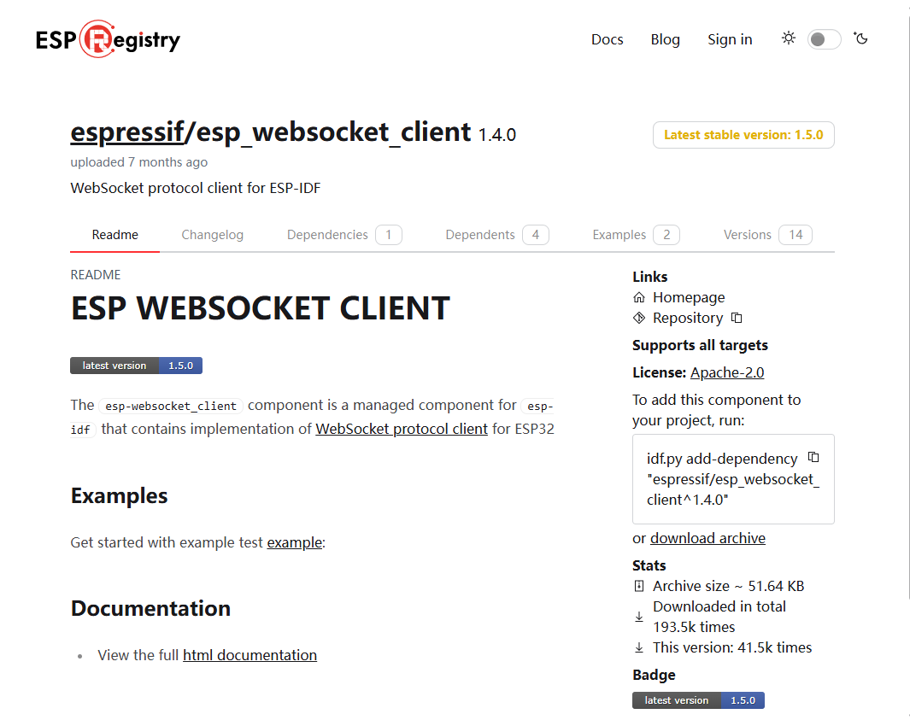
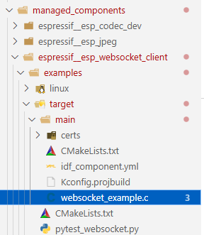

# WebSocket协议

#   WebSocket简介
WebSocket 协议是一种应用层通信协议，设计用于在客户端（如浏览器）和服务器之间建立全双工、持久的连接，使得双方能够实时、双向地交换数据。

WebSocket 协议是通过HTTP 协议升级实现的，但一旦连接建立后，它不再依赖 HTTP，而是使用独立的协议来进行高效、低延迟的通信。

WebSocket 协议的通信是基于客户端和服务器之间的连接，通过升级 HTTP 连接来完成。它的工作过程如下：

1. 建立连接

客户端首先发送一个 HTTP 请求到服务器，请求升级协议为 WebSocket。这个请求包含了一个 Upgrade 头部，表示希望将协议从 HTTP 升级为 WebSocket。

```c
GET /chat HTTP/1.1
Host: example.com
Upgrade: websocket
Connection: Upgrade
Sec-WebSocket-Key: dGhlIHNhbXBsZSBub25jZQ==
Sec-WebSocket-Version: 13
```

如果服务器支持 WebSocket 协议，它会回应一个 HTTP 101 响应，表示协议升级成功，连接已经建立为 WebSocket 连接。响应头示例如下：

```c
HTTP/1.1 101 Switching Protocols
Upgrade: websocket
Connection: Upgrade
Sec-WebSocket-Accept: x3JJHMbDL1EzLkh9Qd1F3rAt01M=
```

2. 数据传输

一旦连接建立，客户端和服务器就可以通过 WebSocket 通道发送和接收消息。WebSocket 消息可以是文本（如 JSON 或 HTML）或二进制数据（如图像、音频或视频）。

WebSocket 协议的传输是基于帧（Frame）的，每个消息可以拆分成一个或多个帧进行传输。

3. 关闭连接

当通信结束时，任意一方（客户端或服务器）可以发起关闭请求，发送一个 Close 帧。关闭帧会通知另一方该连接将被关闭，另一方应当发送一个确认的关闭帧。

完成<font style="color:red;">握手</font>后，连接将关闭。

## WebSocket 协议帧格式
WebSocket 协议通过帧（Frame）进行数据的传输，每个 WebSocket 帧包含以下内容：

+ 帧头（Header）：包含控制信息，如是否是最后一个数据帧、数据的长度等。
+ 数据载荷（Payload Data）：包含实际的数据内容。

**<font style="color:red;">帧头格式：</font>**

1. **FIN**：1 位，表示是否为最后一个数据帧。如果为 1，则表示该帧是消息的最后一帧。
2. **RSV1, RSV2, RSV3**：各 1 位，用于协议扩展，通常为 0。
3. **Opcode**：4 位，表示数据的类型。例如：

0x1：文本帧（Text Frame）

0x2：二进制帧（Binary Frame）

0x8：关闭帧（Close Frame）

0x9：Ping 帧（Ping Frame）

0xA：Pong 帧（Pong Frame）

4. Mask：1 位，指示**是否**使用了掩码。对于客户端发送的消息，必须使用掩码，而服务器发送的消息可以不使用掩码。
5. Payload Length：数据的长度，可以是 7 位、7+16 位或者 7+64 位，取决于数据的长度。
6. Masking Key：如果 Mask 标志为 1，则会有一个掩码密钥，用于对数据进行异或操作以增加安全性。

## WebSocket应用场景
1. 实时聊天： WebSocket 是在线聊天应用中非常常见的协议，客户端和服务器之间可以实时交换消息，不需要每次都建立新的连接。
2. 在线游戏：在多人在线游戏中，游戏状态的实时更新需要低延迟的数据交换，WebSocket 能有效满足这一需求。
3. 金融和股票交易系统：需要实时的市场数据更新，WebSocket 可以帮助客户端接收来自服务器的实时股票报价和交易信息。
4. 物联网（IoT）： WebSocket 用于传输实时传感器数据和控制信息，适用于智能家居、工业自动化等 IoT 场景。
5. 实时通知系统： WebSocket 可用于推送通知，例如社交媒体、新闻推送、邮件通知等。


# WebSocket移植




## App_WS.h
```c
#ifndef __APP_WS_H__
#define __APP_WS_H__

#include <stdio.h>
#include "esp_wifi.h"
#include "esp_system.h"
#include "nvs_flash.h"
#include "esp_event.h"
#include "esp_crt_bundle.h"

#include "freertos/FreeRTOS.h"
#include "freertos/task.h"
#include "freertos/semphr.h"
#include "freertos/event_groups.h"

#include "esp_log.h"
#include "esp_websocket_client.h"
#include "esp_event.h"
#include <cJSON.h>
#include "Com_Debug.h"
#include "Int_ES8311.h"
#include "freertos/ringbuf.h"
#include "Dri_OV2640.h"
#include "Int_WS2812.h"

#define NO_DATA_TIMEOUT_SEC 5

/**
 * @brief websocket 初始化
 * 
 */
void App_WS_Init(void);

/**
 * @brief 开启 websocket 音频客户端
 *
 * @param dir 传入参数
 */
void App_WS_Audio_Start(char *dir);

/**
 * @brief 关闭 websocket 音频客户端
 *
 * @param dir 传入参数
 */
void App_WS_Audio_Close(char *dir);

/**
 * @brief wssocket发送二进制数据
 *
 */
void App_WS_SendBinData(esp_websocket_client_handle_t client, char *data, int len);

/**
 * @brief 视频传输初始化
 * 
 */
void App_WS_Video_Client_Init(void);

/**
 * @brief 视频传输启动
 * 
 */
void App_WS_Video_Client_Start(void);

/**
 * @brief 视频传输关闭
 * 
 */
void App_WS_Video_Client_Close(void);

#endif /* __APP_WS_H__ */
```

## Dri_WS.c
```c
#include "App_WS.h"

static const char *TAG = "websocket";
// 创建一个音频客户端的句柄
esp_websocket_client_handle_t audio_client;
esp_websocket_client_handle_t video_client;

// 两个标志位 表示当前audio客户端正在发送和接收
static uint8_t isSending = 0;
static uint8_t isReceing = 0;

// 发送音频数据的两个任务句柄
TaskHandle_t App_WS_MicToBuffer_Handle;
TaskHandle_t App_WS_BufferToWS_Handle;

// 创建一个视频客户端的任务句柄
TaskHandle_t App_WS_VideoTask_Handle;

// 任务函数声明
void App_WS_MicToBuffer_Task(void *args);
void App_WS_BufferToWS_Task(void *args);
void App_WS_Video_Task(void *args);
void App_WS_video_Task(void *args);

// 环形缓冲区句柄
RingbufHandle_t ringBufferHandle;

// 是否关闭esp2client的标志位
uint8_t isCloseEspToClientFlag = 0;
// 是否关闭视频任务的标志位
uint8_t isCloseVideoFlag = 0;

/**
 * @brief WS回调函数
 */
static void websocket_event_handler(void *handler_args, esp_event_base_t base, int32_t event_id, void *event_data)
{
    esp_websocket_event_data_t *data = (esp_websocket_event_data_t *)event_data;
    switch (event_id)
    {
    case WEBSOCKET_EVENT_BEGIN:
        ESP_LOGI(TAG, "WEBSOCKET_EVENT_BEGIN");
        break;
    case WEBSOCKET_EVENT_CONNECTED:
        ESP_LOGI(TAG, "WEBSOCKET_EVENT_CONNECTED");
        break;
    case WEBSOCKET_EVENT_DISCONNECTED:
        ESP_LOGI(TAG, "WEBSOCKET_EVENT_DISCONNECTED");
        break;
    case WEBSOCKET_EVENT_DATA:
        // ESP_LOGI(TAG, "WEBSOCKET_EVENT_DATA");
        // ESP_LOGI(TAG, "Received opcode=%d", data->op_code);
        if (data->op_code == 0x2)
        { // Opcode 0x2 indicates binary data
            // ESP_LOG_BUFFER_HEX("Received binary data", data->data_ptr, data->data_len);
            MY_LOGI("Received binary data");
            Int_ES8311_WriteToSpeaker((uint8_t *)data->data_ptr, (uint16_t)data->data_len);
        }
        break;
    case WEBSOCKET_EVENT_ERROR:
        ESP_LOGI(TAG, "WEBSOCKET_EVENT_ERROR");
        break;
    case WEBSOCKET_EVENT_FINISH:
        ESP_LOGI(TAG, "WEBSOCKET_EVENT_FINISH");
        break;
    }
}

/**
 * @brief WS初始化
 */
void App_WS_Init(void)
{
    // 1. 创建配置对象
    esp_websocket_client_config_t websocket_cfg = {
        .uri = "ws://192.168.243.229:8000/ws/from_esp",
    };

    // 2. 初始化客户端
    audio_client = esp_websocket_client_init(&websocket_cfg);

    // 补充: 创建视频客户端
    websocket_cfg.uri = "ws://192.168.243.229:8000/ws/image";

    video_client = esp_websocket_client_init(&websocket_cfg);
    
    // 3. 注册回调函数
    esp_websocket_register_events(audio_client, WEBSOCKET_EVENT_ANY, websocket_event_handler, (void *)audio_client);
    esp_websocket_register_events(video_client, WEBSOCKET_EVENT_ANY, websocket_event_handler, (void *)video_client);

    // 4. 创建环形缓冲器 用来方便将来从mic中读取数据的存储 和 写入给WS
    ringBufferHandle = xRingbufferCreate(16000, RINGBUF_TYPE_NOSPLIT);
}

/**
 * @brief WS的音频客户端的启动
 */
void App_WS_Audio_Start(char *dir)
{
    // 判断audio_client存在  并且 没有启动连接 的时候 才会执行启动audio_client
    if (audio_client != NULL && !esp_websocket_client_is_connected(audio_client))
    {
        MY_LOGI("open audio client......\r\n");
        Int_ES8311_Init();
        esp_websocket_client_start(audio_client);
    }

    if (strcmp(dir, "client2esp") == 0)
    {
        isReceing = 1;
    }
    else if (strcmp(dir, "esp2client") == 0)
    {
        isSending = 1;
        // 这个位置,是可视化客户端点击开始接收门铃数据的命令执行所在位置
        if (App_WS_MicToBuffer_Handle == NULL)
        {
            xTaskCreate(App_WS_MicToBuffer_Task, "App_WS_MicToBuffer_Task", 2048, (void *)NULL, 5, &App_WS_MicToBuffer_Handle);
        }

        if (App_WS_BufferToWS_Handle == NULL)
        {
            xTaskCreate(App_WS_BufferToWS_Task, "App_WS_BufferToWS_Task", 2048, (void *)NULL, 5, &App_WS_BufferToWS_Handle);
        }
    }
}

/**
 * @brief WS的音频客户端的关闭
 */
void App_WS_Audio_Close(char *dir)
{
    if (strcmp(dir, "client2esp") == 0)
    {
        isReceing = 0;
    }
    else if (strcmp(dir, "esp2client") == 0)
    {
        isSending = 0;
        // 删除音频发送任务
        isCloseEspToClientFlag = 2;
    }

    // 判断发送和接收都要关闭 才放行
    if (isReceing != 0 || isSending != 0)
    {
        return;
    }

    // 只有audio_client存在 并且没有被关闭  才会执行关闭
    if (audio_client != NULL && esp_websocket_client_is_connected(audio_client))
    {
        MY_LOGI("close audio client......\r\n");
        Int_ES8311_DeInit();
        esp_websocket_client_close(audio_client, portMAX_DELAY);
    }

    // if (App_WS_MicToBuffer_Handle != NULL)
    // {
    //     vTaskDelete(App_WS_MicToBuffer_Handle);
    //     App_WS_MicToBuffer_Handle = NULL;
    // }
    // if (App_WS_BufferToWS_Handle != NULL)
    // {
    //     vTaskDelete(App_WS_BufferToWS_Handle);
    //     App_WS_BufferToWS_Handle = NULL;
    // }
}

/**
 * @brief 向服务器发送二进制数据
 */
void App_WS_SendBinData(esp_websocket_client_handle_t client, char *data, int len)
{
    if (client != NULL && esp_websocket_client_is_connected(client) && len > 0)
    {
        esp_websocket_client_send_bin(client, data, len, portMAX_DELAY);
    }
}

/**
 * @brief 读Mic数据传递给缓冲器任务函数
 */
void App_WS_MicToBuffer_Task(void *args)
{
    // 环形缓冲区每次在存入数据的时候 会添加一个8字节的头信息
    uint8_t data[500 - 8] = {0};
    while (1)
    {
        // 从麦克风读数据
        Int_ES8311_ReadFromMic(data, sizeof(data));

        // 把数据写入环形缓冲器
        xRingbufferSend(ringBufferHandle, data, sizeof(data), portMAX_DELAY);

        // 如果需要删除当前任务,则等待任务执行完成后,自杀
        if (isCloseEspToClientFlag != 0)
        {
            /* code */
            isCloseEspToClientFlag--;
            App_WS_MicToBuffer_Handle = NULL;
            vTaskDelete(NULL);
        }

        vTaskDelay(10);
    }
}

/**
 * @brief 读缓冲器数据传递给WS任务函数
 */
void App_WS_BufferToWS_Task(void *args)
{
    size_t len = 0;
    while (1)
    {
        // 先从环形缓冲器读取数据
        void *data = xRingbufferReceive(ringBufferHandle, &len, portMAX_DELAY);

        // 判断是否读取到了数据
        if (len > 0)
        {
            App_WS_SendBinData(audio_client, (char *)data, len);
            vRingbufferReturnItem(ringBufferHandle, data);
            len = 0;
        }

        // 如果需要删除当前任务,则等待任务执行完成后,自杀
        if (isCloseEspToClientFlag != 0)
        {
            /* code */
            isCloseEspToClientFlag--;
            App_WS_BufferToWS_Handle = NULL;
            vTaskDelete(NULL);
        }

        vTaskDelay(10);
    }
}

/**
 * @brief 初始化视频客户端
 *
 */
void App_WS_Video_Client_Init(void)
{
    Dri_OV2640_Init();
}

/**
 * @brief 启动视频客户端
 *
 */
void App_WS_Video_Client_Start(void)
{
    // 判断video_client存在  并且 没有启动连接 的时候 才会执行启动video_client
    if (video_client != NULL && !esp_websocket_client_is_connected(video_client))
    {
        MY_LOGI("open video client......\r\n");
        esp_websocket_client_start(video_client);
    }

    if (App_WS_VideoTask_Handle == NULL)
    {
        xTaskCreate(App_WS_video_Task, "App_WS_video_Task", 4096, (void *)NULL, 10, &App_WS_VideoTask_Handle);
    }
}

/**
 * @brief 关闭视频客户端
 *
 */
void App_WS_Video_Client_Close(void)
{
    // 只有video_client存在 并且没有被关闭  才会执行关闭
    if (video_client != NULL && esp_websocket_client_is_connected(video_client))
    {
        MY_LOGI("close video client......\r\n");
        esp_websocket_client_close(video_client, portMAX_DELAY);

        if (App_WS_VideoTask_Handle != NULL)
        {
            // 删除音频发送任务
            isCloseEspToClientFlag = 1;
        }
    }
}

/**
 * @brief 视频任务函数
 *
 * @param args
 */
void App_WS_video_Task(void *args)
{
    uint8_t *data;
    uint32_t len = 0;
    while (1)
    {
        Dri_OV2640_TakePic(&data, &len);
        App_WS_SendBinData(video_client, (char *)data, (int)len);
        Dri_OV2640_ReturnPic();

        // 如果需要删除当前任务,则等待任务执行完成后,自杀
        if (isCloseVideoFlag != 0)
        {
            isCloseVideoFlag--;
            App_WS_VideoTask_Handle = NULL;
            vTaskDelete(NULL);
        }

        vTaskDelay(30);
    }
}
```
