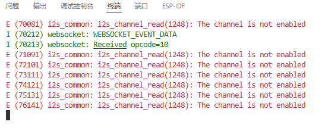

# 音频的收发

# WS客户端发送二进制数据封装
App_WS.c

```c
/**
 * @brief 向服务器发送二进制数据
 */
void App_WS_SendBinData(esp_websocket_client_handle_t client, char *data, int len)
{
    if (client != NULL && esp_websocket_client_is_connected(client) && len > 0)
    {
        esp_websocket_client_send_bin(client, data, len, portMAX_DELAY);
    }
}
```

# 创建环形缓冲区
App_WS.c

```c
RingbufHandle_t ringBuf;

// 创建ws连接 并连接服务器
void App_WS_Init(void)
{
    //......
    // 创建环形缓冲区
    ringBuf = xRingbufferCreate(16000, RINGBUF_TYPE_NOSPLIT);
}
```


# 创建和删除音频任务
App_WS.c

```c
TaskHandle_t micToBufferTaskHandle;
TaskHandle_t BufferToWSTaskHandle;


/**
 * @brief WS的音频客户端的启动
 */
void App_WS_Audio_Start(char *dir)
{
    // 判断audio_client存在  并且 没有启动连接 的时候 才会执行启动audio_client
    if (audio_client != NULL && !esp_websocket_client_is_connected(audio_client))
    {
        MY_LOGI("open audio client......\r\n");
        Int_ES8311_Init();
        esp_websocket_client_start(audio_client);
    }

    if (strcmp(dir, "client2esp") == 0)
    {
        isReceing = 1;
    }
    else if (strcmp(dir, "esp2client") == 0)
    {
        isSending = 1;
        // 这个位置,是可视化客户端点击开始接收门铃数据的命令执行所在位置
        if (App_WS_MicToBuffer_Handle == NULL)
        {
            xTaskCreate(App_WS_MicToBuffer_Task, "App_WS_MicToBuffer_Task", 2048, (void *)NULL, 5, &App_WS_MicToBuffer_Handle);
        }

        if (App_WS_BufferToWS_Handle == NULL)
        {
            xTaskCreate(App_WS_BufferToWS_Task, "App_WS_BufferToWS_Task", 2048, (void *)NULL, 5, &App_WS_BufferToWS_Handle);
        }
    }
}


/**
 * @brief WS的音频客户端的关闭
 */
void App_WS_Audio_Close(char *dir)
{
    if (strcmp(dir, "client2esp") == 0)
    {
        isReceing = 0;
    }
    else if (strcmp(dir, "esp2client") == 0)
    {
        isSending = 0;
        // 删除音频发送任务
        isCloseEspToClientFlag = 2;
    }

    // 判断发送和接收都要关闭 才放行
    if (isReceing != 0 || isSending != 0)
    {
        return;
    }

    // 只有audio_client存在 并且没有被关闭  才会执行关闭
    if (audio_client != NULL && esp_websocket_client_is_connected(audio_client))
    {
        MY_LOGI("close audio client......\r\n");
        Int_ES8311_DeInit();
        esp_websocket_client_close(audio_client, portMAX_DELAY);
    }

    // if (App_WS_MicToBuffer_Handle != NULL)
    // {
    //     vTaskDelete(App_WS_MicToBuffer_Handle);
    //     App_WS_MicToBuffer_Handle = NULL;
    // }
    // if (App_WS_BufferToWS_Handle != NULL)
    // {
    //     vTaskDelete(App_WS_BufferToWS_Handle);
    //     App_WS_BufferToWS_Handle = NULL;
    // }
}
```


# 任务函数
```c

/**
 * @brief 读Mic数据传递给缓冲器任务函数
 */
void App_WS_MicToBuffer_Task(void *args)
{
    // 环形缓冲区每次在存入数据的时候 会添加一个8字节的头信息
    uint8_t data[500 - 8] = {0};
    while (1)
    {
        // 从麦克风读数据
        Int_ES8311_ReadFromMic(data, sizeof(data));

        // 把数据写入环形缓冲器
        xRingbufferSend(ringBufferHandle, data, sizeof(data), portMAX_DELAY);

        // 如果需要删除当前任务,则等待任务执行完成后,自杀
        if (isCloseEspToClientFlag != 0)
        {
            /* code */
            isCloseEspToClientFlag--;
            App_WS_MicToBuffer_Handle = NULL;
            vTaskDelete(NULL);
        }

        vTaskDelay(10);
    }
}

/**
 * @brief 读缓冲器数据传递给WS任务函数
 */
void App_WS_BufferToWS_Task(void *args)
{
    size_t len = 0;
    while (1)
    {
        // 先从环形缓冲器读取数据
        void *data = xRingbufferReceive(ringBufferHandle, &len, portMAX_DELAY);

        // 判断是否读取到了数据
        if (len > 0)
        {
            App_WS_SendBinData(audio_client, (char *)data, len);
            vRingbufferReturnItem(ringBufferHandle, data);
            len = 0;
        }

        // 如果需要删除当前任务,则等待任务执行完成后,自杀
        if (isCloseEspToClientFlag != 0)
        {
            /* code */
            isCloseEspToClientFlag--;
            App_WS_BufferToWS_Handle = NULL;
            vTaskDelete(NULL);
        }

        vTaskDelay(10);
    }
}
```


# bug
## bug展示
多次开关来访者声音


