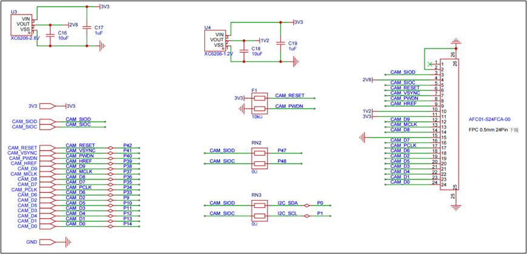
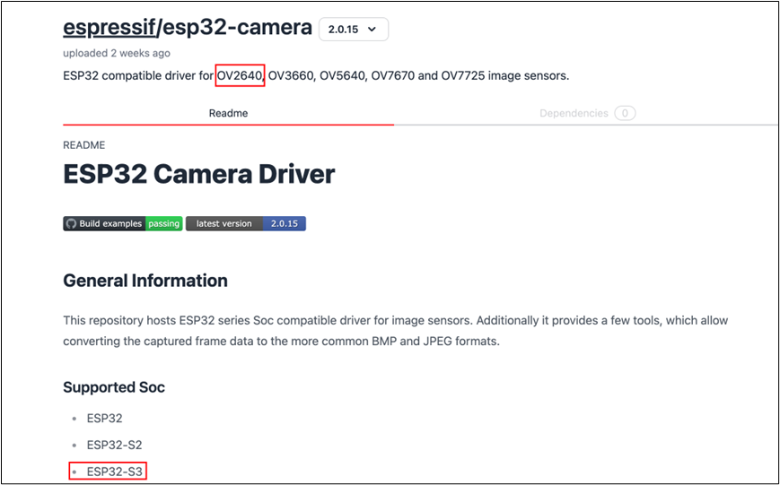

# 摄像头驱动

# 硬件电路设计


# 使用espressif/esp32-camera组件
## 添加组件
组件地址: 

[https://components.espressif.com/components/espressif/esp32-camera/versions/2.0.15](https://components.espressif.com/components/espressif/esp32-camera/versions/2.0.15)



组件添加命令:

`idf.py add-dependency "espressif/esp32-camera^2.0.15"`

```
idf.py add-dependency "espressif/esp32-camera^2.0.15"
```

## 组件位置


# OV2640驱动
## Dri_OV2640.h
```c
#ifndef __DRI_OV2640_H__
#define __DRI_OV2640_H__

#include <esp_log.h>
#include <esp_system.h>
#include <nvs_flash.h>
#include <sys/param.h>
#include <string.h>

#include "freertos/FreeRTOS.h"
#include "freertos/task.h"

#include "esp_camera.h"

#include "Com/Com_Debug.h"

#define CAM_PIN_PWDN 40
#define CAM_PIN_RESET 42 // software reset will be performed
#define CAM_PIN_VSYNC 41
#define CAM_PIN_HREF 39
#define CAM_PIN_PCLK 34
#define CAM_PIN_XCLK 37
#define CAM_PIN_SIOD 0
#define CAM_PIN_SIOC 1
#define CAM_PIN_D0 9
#define CAM_PIN_D1 11
#define CAM_PIN_D2 12
#define CAM_PIN_D3 10
#define CAM_PIN_D4 33
#define CAM_PIN_D5 35
#define CAM_PIN_D6 36
#define CAM_PIN_D7 38

/**
 * @brief OV2640初始化
 * 
 */
void Dri_OV2640_Init(void);

/**
 * @brief 拿到照片数据
 * 
 * @param data 拿到的数据
 * @param len 数据长度
 */
void Dri_OV2640_TakePic(uint8_t **data,uint32_t *len);

/**
 * @brief 把照片数据上传到服务端
 * 
 */
void Dri_OV2640_ReturnPic(void);

#endif /* __DRI_OV2640_H__ */

```

## Dri_OV2640.c
```c
#include "Dri_OV2640.h"

static const char *TAG = "take_picture";

/**
 * @brief OV2640初始化
 *
 */
void Dri_OV2640_Init(void)
{
    camera_config_t camera_config = {
        .pin_pwdn = CAM_PIN_PWDN,
        .pin_reset = CAM_PIN_RESET,
        .pin_xclk = CAM_PIN_XCLK,
        .pin_sccb_sda = CAM_PIN_SIOD,
        .pin_sccb_scl = CAM_PIN_SIOC,

        .pin_d7 = CAM_PIN_D7,
        .pin_d6 = CAM_PIN_D6,
        .pin_d5 = CAM_PIN_D5,
        .pin_d4 = CAM_PIN_D4,
        .pin_d3 = CAM_PIN_D3,
        .pin_d2 = CAM_PIN_D2,
        .pin_d1 = CAM_PIN_D1,
        .pin_d0 = CAM_PIN_D0,
        .pin_vsync = CAM_PIN_VSYNC,
        .pin_href = CAM_PIN_HREF,
        .pin_pclk = CAM_PIN_PCLK,

        // XCLK 20MHz or 10MHz for OV2640 double FPS (Experimental)
        .xclk_freq_hz = 20000000,
        .ledc_timer = LEDC_TIMER_0,
        .ledc_channel = LEDC_CHANNEL_0,

        .pixel_format = PIXFORMAT_JPEG,  // YUV422,GRAYSCALE,RGB565,JPEG
        .frame_size = FRAMESIZE_QQVGA, // QQVGA-UXGA, For ESP32, do not use sizes above QVGA when not JPEG. The performance of the ESP32-S series has improved a lot, but JPEG mode always gives better frame rates.

        .jpeg_quality = 30, // 0-63, for OV series camera sensors, lower number means higher quality
        .fb_count = 1,      // When jpeg mode is used, if fb_count more than one, the driver will work in continuous mode.
        .fb_location = CAMERA_FB_IN_PSRAM,
        .grab_mode = CAMERA_GRAB_WHEN_EMPTY,
    };
    // 初始化相机
    esp_err_t err = esp_camera_init(&camera_config);
    if (err != ESP_OK)
    {
        ESP_LOGE(TAG, "Camera Init Failed");
    }
}

camera_fb_t *pic;

/**
 * @brief 拿到照片数据
 *
 * @param data 拿到的数据
 * @param len 数据长度
 */
void Dri_OV2640_TakePic(uint8_t **data, uint32_t *len)
{
    pic = esp_camera_fb_get();
    *data = pic->buf;
    *len = pic->len;
}

/**
 * @brief 释放资源                                  
 *
 */
void Dri_OV2640_ReturnPic(void)
{
    esp_camera_fb_return(pic);
}

```


