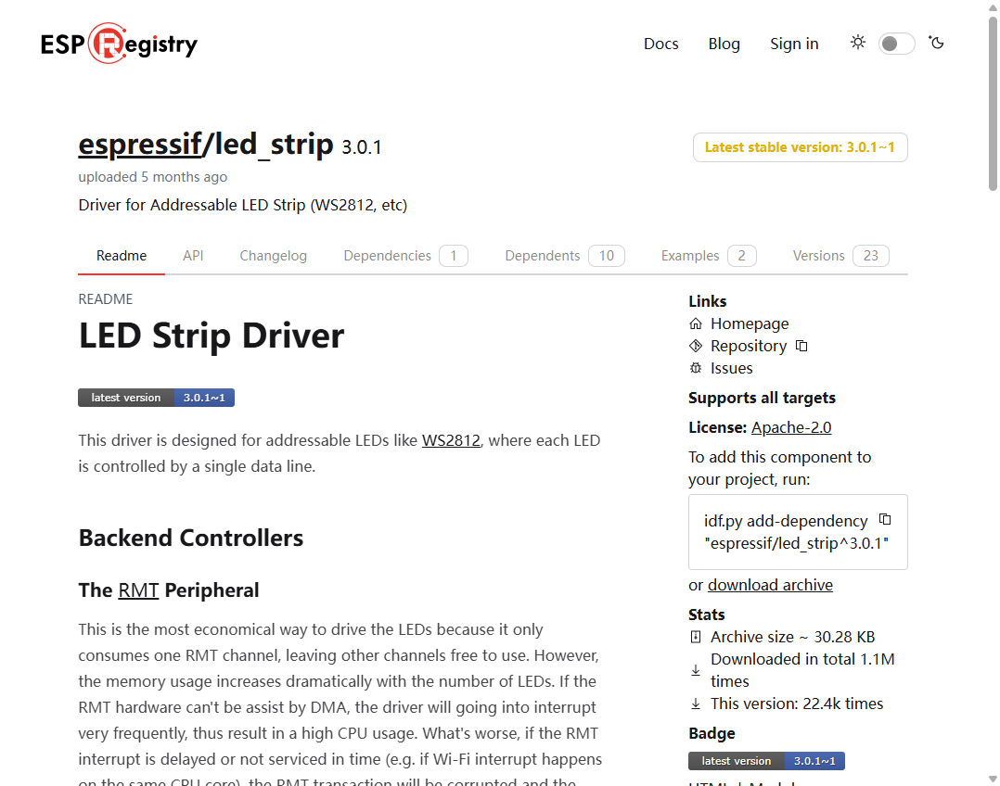

# 灯光照明

# 安装组件


# 驱动
## Int_WS2812.h
```c
#ifndef __INT_WS2812_H__
#define __INT_WS2812_H__

#include <stdio.h>
#include "freertos/FreeRTOS.h"
#include "freertos/task.h"
#include "led_strip.h"
#include "esp_log.h"
#include "esp_err.h"

// Set to 1 to use DMA for driving the LED strip, 0 otherwise
// Please note the RMT DMA feature is only available on chips e.g. ESP32-S3/P4
#define LED_STRIP_USE_DMA 0

// Numbers of the LED in the strip
#define LED_STRIP_LED_COUNT 2
#define LED_STRIP_MEMORY_BLOCK_WORDS 0 // let the driver choose a proper memory block size automatically

// GPIO assignment
#define LED_STRIP_GPIO_PIN 46

// 10MHz resolution, 1 tick = 0.1us (led strip needs a high resolution)
#define LED_STRIP_RMT_RES_HZ (10 * 1000 * 1000)

/**
 * @brief 初始化WS2812
 * 
 */
void Int_WS2812_Init(void);

/**
 * @brief 打开WS2812
 * 
 * @param index 索引
 * @param red 红色值
 * @param green 绿色值
 * @param blue 蓝色值
 */
void Int_WS2812_LEDOpen(uint32_t index, uint32_t red, uint32_t green, uint32_t blue);

/**
 * @brief 关闭WS2812
 * 
 */
void Int_WS2812_LEDClose(void);

#endif /* __INT_WS2812_H__ */

```

## Int_WS2812.c
```c
#include "Int_WS2812.h"

// LED Strip object handle
led_strip_handle_t led_strip;

/**
 * @brief 初始化WS2812
 *
 */
void Int_WS2812_Init(void)
{
    // LED strip general initialization, according to your led board design
    led_strip_config_t strip_config = {
        .strip_gpio_num = LED_STRIP_GPIO_PIN,                        // The GPIO that connected to the LED strip's data line
        .max_leds = LED_STRIP_LED_COUNT,                             // The number of LEDs in the strip,
        .led_model = LED_MODEL_WS2812,                               // LED strip model
        .color_component_format = LED_STRIP_COLOR_COMPONENT_FMT_GRB, // The color order of the strip: GRB
        .flags = {
            .invert_out = false, // don't invert the output signal
        }};

    // LED strip backend configuration: RMT
    led_strip_rmt_config_t rmt_config = {
        .clk_src = RMT_CLK_SRC_DEFAULT,                    // different clock source can lead to different power consumption
        .resolution_hz = LED_STRIP_RMT_RES_HZ,             // RMT counter clock frequency
        .mem_block_symbols = LED_STRIP_MEMORY_BLOCK_WORDS, // the memory block size used by the RMT channel
        .flags = {
            .with_dma = LED_STRIP_USE_DMA, // Using DMA can improve performance when driving more LEDs
        }};

    led_strip_new_rmt_device(&strip_config, &rmt_config, &led_strip);
}

/**
 * @brief 打开WS2812
 *
 * @param index 索引
 * @param red 红色值
 * @param green 绿色值
 * @param blue 蓝色值
 */
void Int_WS2812_LEDOpen(uint32_t index, uint32_t red, uint32_t green, uint32_t blue)
{
    led_strip_set_pixel(led_strip, index, red, green, blue);
    led_strip_refresh(led_strip);
}

/**
 * @brief 关闭WS2812
 *
 */
void Int_WS2812_LEDClose(void)
{
    led_strip_clear(led_strip);
    led_strip_refresh(led_strip);
}


```

